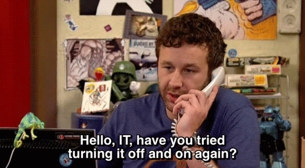
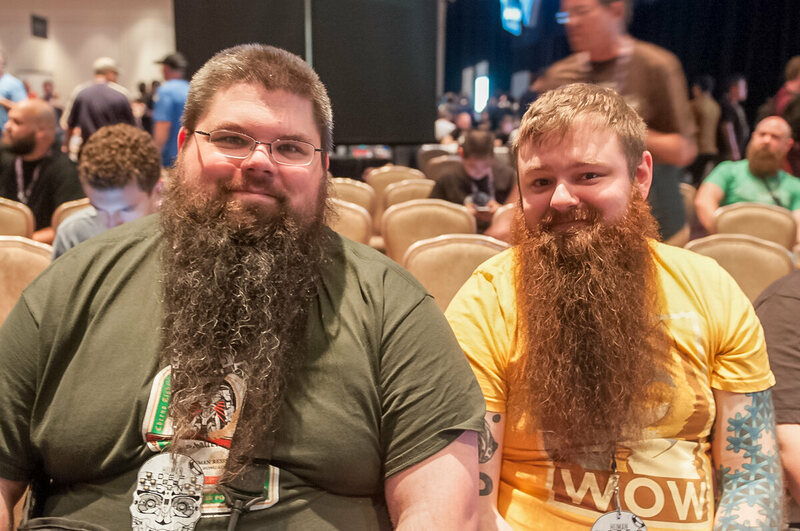
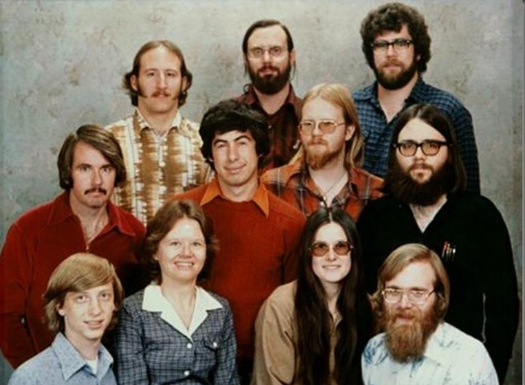
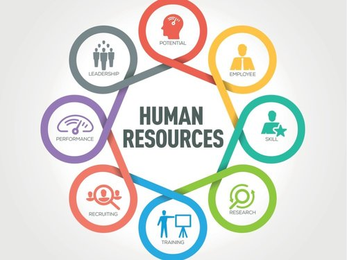
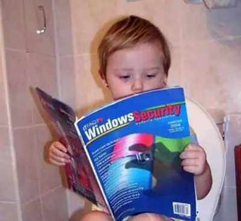

## Знайомство з викладачем

# Хто є хто в IT?

### В АйТі страждають усі, але всі по-різному.

Існує міф, що сфера інформаційних технологій – сфера проста, легка, але грошова. Не будемо сперечатися, у сфері справді є гроші, і це не є секретом. Інше питання, чи легко у цій сфері, і якщо так, то кому.

Правильна відповідь – нікому. У кожній професії тут доводиться довго та багато працювати, і працювати напружено. На багато посад претендують кілька людей, за багатьма фахівцями та їх продуктивністю праці спостерігає цілий спектр менеджерів різних ланок, іноді навіть з різних країн, і прохолоджуватися в IT вдається вкрай рідко.

**МІФ: В АйТі легко та просто.**

Практично кожен спеціаліст, який працює в IT, набагато частіше, ніж фахівці інших областей, працює на межі своїх можливостей і постійно розширює ці межі.

Інше питання, що у кожного свої межі та свої можливості, і кожен має обирати собі професію за своїми задатками.

Сьогодні ми розглянемо професії в IT і спробуємо розібратися, що являють собою завдання фахівців цих професій і які якості потрібні для успіху в кожній конкретній професії.

### Основою роботи є проект.

Для того, щоб будь-який фахівець міг почати нормально працювати в компанії, компанії потрібно мати гроші, або мати домовленості про отримання грошей. Гроші зазвичай беруться із двох джерел: інвестори та клієнти. Інвестори, як правило, інвестують у продуктові компанії, а клієнти замовляють у аутсорсних чи просто девелоперських компаній. Бувають різні види перетину та поєднання типів компаній, але в будь-якому випадку основою роботи є проект, який приносить гроші.

## Звідки беруться проекти?  Sales Manager

Проекти до компанії "заводить" sales manager. Менеджер з продажу. Хто це? Це обов'язково люди, які чудово виглядають, які справляють враження успіху. Це люди, які проводять більшу частину свого часу у спілкуванні з клієнтами та пошуку інших потенційних клієнтів.

Менеджери по продажах займаються лідогенерацією (пошуком лідів - майбутніх клієнтів), закриттям угод, всіма домовленностями до, під час, після та навколо угод. Зазвичай саме лідогенерація займає безліч часу та повертає дуже мало результатів.

На жаль, sales manager-ам часто доводиться вислужуватися перед клієнтами, вислуховувати численні скарги як з боку клієнта, так і з боку команди, яка з ним працює, обіцяти те, чого бути не може або що дуже сумнівно, і вирішувати складності, що постійно виникають.

Sales manager повинен мати прекрасну розмовну та письмову англійську мову, вміти знаходити спільну мову навіть із найскладнішими людьми і вирішувати навіть найскладніші проблеми комунікативного характеру.

**Страждання:** 

- доступність: потрібно бути доступним у будь-який час дня та ночі;
- "жилетка для клієнта": потрібно терпіти найдивніші та найдовші виливання клієнта, потрібно постійно залучатися до різних проблем спілкування та відгукуватися на них;
- терміни: постійний пресинг від керівництва, потрібно заводити проекти швидше, швидше та швидше;
- вихлоп: дуже багато зусиль і дуже мало результату, сотні листів та одиниці відповідей.

## Що далі відбувається із проектом?  Project Manager

Далі за проект береться менеджер проектів (Project Manager).
Буває, що вже на етапі спілкування сейлза із замовником саме ПМ бере на себе оцінювання майбутнього проекта, яке він робить з командою розробників.
До початку розробки та під час її він спілкується з представниками замовника з одного боку та виробництвом з іншого боку. Розподіл відповідальності між представниками виробництва, відповідальність як перед замовником, так і перед командою розробки та ще й перед керівництвом компанії.

**Страждання:** 

- доступність: як і sales, pm-у іноді необхідно бути доступним у будь-який час дня та ночі для контакту із замовником та командою;
- мотиватор: вирішувати проблеми мотивації команди, збирати негатив із трьох сторін, видавати позитив у три сторони;
- терміни: проект має дедлайн, і завдання ПМ-а - встигнути до нього, якісно і правильно, звідси постійний тиск чинника часу.

## Звідки береться виробництво - Recruitment

Наймом персоналу займаються рекрутери. Їхня робота є нескінченним пошуком фахівців різних профілів у стислий термін і з розмитими вимогами. Типовий запит до рекрутерів: "нам до кінця тижня потрібні два круті джавісти, подивися на вимоги, що там у трендах...". 
У ті дні, коли у рекрутера немає відкритих вакансій або вже закінчуються можливості для пошуку людей, хороший рекрутер наповнює базу знайомих фахівців, яких можна покликати на роботу у разі потенційного авралу, вивчає технічні терміни, стежить за трендами, відвідує конференції та будь-яким іншим способом вливається. в АйТі субкультуру.

**Страждання:** 

- терміни: часто необхідно знайти відповідного спеціаліста в дуже стислий термін;
- технічне розуміння: рекрутер МАЄ розуміти деталі тезнчіного досвіду як кандидатів, так і вакансій, й докладати максимум зусиль, щоб цю інформацію здобути та зрозуміти;
- ставлення: рекрутерів рідко сприймають частиною команди, частіше як допоміжний персонал, дещо звисока;
- розпливчасті вимоги: завжди доводиться з'ясовувати, кого саме шукати, чому цей хлопець підходить, а цей ні, тощо.

## Хто кодить? Програмісти

Завдання програміста описуються просто - вони повинні писати програмний код швидко і якісно. За допомогою цього коду вони повинні створювати нові елементи проекту, або виправляти існуючі проблеми проекту, або підтримувати його працездатність. Також програмісти:

- планують та оцінюють тривалість (за скільки годин) та довгочасність (протягом якого часу будуть витрачені ці кілька годин) виконання поставленого завдання
- виконують код ревью роботи один одного

- пишуть документацію про проект та конкретні фічі проекту
- складають різні звіти
- налаштовують системи та програми для спільної роботи (рідше)
- проектують архітектуру проекту чи окремих його елементів

- пишуть юніт-тести

**Страждання:**

- терміни: робота часто відбувається за умов жорсткого дедлайну;
- постійно присутня необхідність вчитися, складно знайти подібну сферу, що так стрімко і динамічно розвивається;
- вагома кількість нетехнічних людей намагається розповісти, як, коли та навіщо програмісту виконувати його роботу;
- завжди потрібно з кимось щось обговорювати, іноді навіть ніколи працювати, а результатами роботи рідко задоволені;
- поширена ситуація, коли результати тривалої роботи у результаті приймаються і відкидаються убік.

## Хто перевіряє їхню роботу? QA/QC/тестувальники

Тестувальники, Quality Assurance та Quality Control. Люди, які чудово вміють виявляти проблеми. В основному в тому, що зробив хтось інший:)

Всі ці люди тим чи іншим чином перевіряють наскільки якісно і відповідно до вимог написаний код і працює програма (сервіс, додаток etc.)
Чому так багато літер і у чому різниця?

QA фахівці займаються не самою перевіркою якості, а підготовчими та організаційними процесами. Наприклад, QA становлять документацію, якою слід перевіряти ПО. QC фахівці, власне, перевіряють програмне забезпечення відповідно до документації від QA.

**Страждання:**

- непостійне та неконтрольоване навантаження;
- монотонна та нудна робота, але це не точно;
- складні стосунки із програмістами;
- чим краще ти працюєш, тим менше тебе люблять колеги, чим гірше працюєш – тим менше цінує клієнт.

## Хто допомагає їм виживати у жорстокому реальному світі - HR

Human Resources manager - менеджер з кадрів - складна та багатогранна професія. HR фахівці інтегрують та адаптують свіжонабраний персонал, контролюють настрої робочого колективу загалом та настрій кожного члена колективу.
 Ідеальний HR знає бажання розробника піти до того, як воно виникає у розробника. У веденні таких фахівців також перегляд зарплат, організація навчання та кар'єрного просування фахівців та багато іншого.

**Страждання:**

- "жилетка для співробітників": HR повинен знати про проблеми співробітників та допомагати шукати способи їх вирішення, це часто призводить до "виливання горя";
- ставлення: HR, як і рекрутерів, рідко сприймають частиною команди, частіше як допоміжний персонал, дещо звисока;
- багато справ: величезний спектр дрібних, середніх та великих обов'язків, не завжди зрозуміло, за що хапатися;
- терміни: від вирішення конфлікту у команді до проведення корпоративу - більшість завдань ставляться одночасно й на учора.

## Хто вміє налаштовувати системи, мережі та навіть переставляє Windows - Sysadmin, DevOps

Існує ряд завдань, які ставлять у глухий кут навіть досить просунутих програмістів. Зокрема, до таких завдань належать складні переустановки операційних систем, налаштування спільної роботи різних програм, перенесення продукту на інший сервер або групу серверів та багато іншого. На випадок таких завдань у компаніях є сисадміни або компанія запрошує знайомого сисадміна. Сисадмін - системний адміністратор - займається встановленням та налаштуванням програм на професійному рівні.

А що таке ДевОпс, DevOps? Це людина, яка оптимізує процес розробки. Розшифровується DevOps як Development Operations (Engineer). Як правило, так називають людину, яка працює на стику сисадмінства та програмування. Займається він налаштуванням та оптимізацією процесу розробки програмного забезпечення. Наприклад, програміст може написати хороший код, але не знає, як це буде працювати на сервері у клієнта, сисадмін може налаштувати сервер у клієнта, а девопс дочистить за програмістом код таким чином, щоб той заробив не тільки на сервері клієнта, але на й більшості доступних серверів.

**Страждання:**

- мало відомих заздалегідь завдань та безліч завдань, розв'язання яких ніхто не знає;
- якщо сисадмін або девопс добре попрацював досить тривалий час - йому нема чого робити, все працює саме, звідси дивні цикли то постійного надмірного завантаження, то нудьги і відсутності завдань;
- можливі авральні роботи у будь-який час дня та ночі;
- перші місця роботи у сисадмінів зазвичай далекі від ідеальних.

##А хто займається красою - Designer

Існує хибна думка, що дизайнери - це художники. Таке трапляється, але це не правило, скоріше художники бачать дизайн як один із природних шляхів свого розвитку. Дизайнер поєднує існуючі елементи дизайну, шрифти, теми, елементи зовнішнього вигляду з різних наборів, іконки, створює нові елементи та змінює існуючі. Дизайнер вивчає тренди зовнішнього вигляду продуктів, як електронних, і звичайних, дизайнер вивчає реакції користувачів на нововведення, дизайнер - свого роду інженер зовнішнього вигляду. Натхнення і творчість у роботі присутні, але з 80%, як здається недосвідченому обивателю, але в 20%, інше - знання, досвід, напрацювання, побажання клієнта.

**Страждання:**

- клієнти та замовники досить часто мають смак, відмінний від смаку дизайнера, і вимагають зовнішнього вигляду продукту, який не узгоджується з розумінням прекрасного чи навіть задовільного самого виконавця;
- досить поширений сценарій, коли замовник не може сформулювати свої побажання, і дизайнеру доводиться вгадувати побажання щоразу;
- багато робіт не приймаються або приймаються після величезної кількості переробок.

Як вибрати правильну професію в АйТі?

Кожен обирає те, до чого його тягне. Кожен може знайти серед усього згаданого ту професію, яка здасться йому чи їй скоріше цікавою, ніж складною, а серед виписаних "страждень" - ті, які здадуться скоріше приємними складнощами, аніж проблемами.

