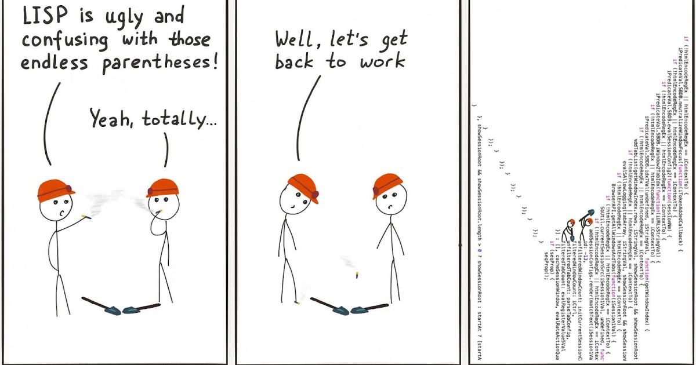
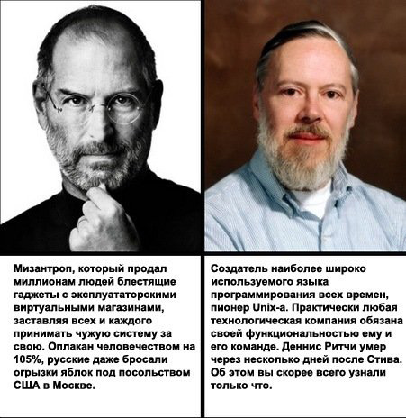

# Другий технічний лікбез - Мови та технології.

### Машинний код або двійковий код, асемблери

Аж до першої половини 60-х років XX століття більшість програмування проводилася на двійковому коді та за допомогою перфокарт. Першим програмуванням можна вважати роботу з машинним кодом.
Для виконання кожної дії там писалися певні інструкції, що переміщували біти та байти у пам'яті. Наприклад, так виводиться вітання Hello world на машинному коді:

```
BB 11 01 B9 0D 00 B4 0E 8A 07 43 CD 10 E2 F9 CD 20 48 65 6C 6C 6F 2C 20 57 6F 72 6C 64 21

10111011 00010001 00000001 10111001 00001101 00000000 10110100 00001110 10001010 00000111
01000011 11001101 00010000 11100010 11111001 11001101 00100000 01001000 01100101 01101100
01101100 01101111 00101100 00100000 01010111 01101111 01110010 01101100 01100100 00100001

```


#### Асемблери (assemblers)

Наприкінці 40-х років починають зʼявлятися мови низького рівня - мови, що працюють із процесором та пам'яттю комп'ютера безпосередньо, байт за байтом. Програми написані такими мовами можуть бути максимально швидкими. Це мови ассемблерів.

```asm
XXXX:0100     mov     bx, 0111h       ; поместить в bx смещение строки HW
XXXX:0103     mov     cx, 000Dh       ; поместить в cx длину строки HW
XXXX:0106     mov     ah, 0Eh         ; поместить в ah номер функции прерывания 10h
XXXX:0108     mov     al, [bx]        ; поместить в al значение ячейки памяти, адрес которой находится в bx
XXXX:010A     inc     bx              ; перейти к следующему байту строки (увеличить смещение на 1)
XXXX:010B     int     10h             ; вызов прерывания 10h
XXXX:010D     loop    0108            ; если cx≠0, то уменьшить cx на 1 и перейти по адресу 0108
XXXX:010F     int     20h             ; прерывание 20h: завершить программу
XXXX:0111 HW  db      'Hello, World!' ; строка, которую требуется напечатать
```

### Перше покоління високорівневих мов: Фортран, Алгол, Кобол, Лісп та інші

#### Фортран(Fortran)

FORmula TRANslator (1957) - мова, написана в компанії IBM. Мова вже високого рівня, але дуже старенька) Все ще іноді використовується хардкорними математиками, оскільки майже всі математичні завдання дрібного та середнього рівня вже давно на ньому вирішені. Остання версія вийшла в 2018 році.


```fortran
program Quadratic
  integer :: a, b, c
  real :: d, p1, p2
  complex :: cp2

  read (*, *), a
  if (a == 0) then
    write (*, *) "Not a quadratic equation"
    stop
  end if
  read (*, *) b
  read (*, *) c
  d = b * b - 4 * a * c
  p1 = - b / 2.0 / a
  if (abs(d) < 1.0e-9) then
    write (*, "(A, F8.3)") "x = ", p1
  elseif (d > 0) then
    p2 = sqrt(d) / 2.0 / a
    write (*, "(2(A, F8.3))") "x1 = ", p1 + p2, char(13) // char(10) // "x2 = ", p1 - p2
  else
    cp2 = sqrt(cmplx(d)) / 2.0 / a
    write (*, "(2(A, F8.3, F8.3), A)") "x1 = (", p1 + cp2, ")" // char(13) // char(10) // "x2 = (", p1 - cp2, ")"
  end if
end
```


#### Кобол (COBOL)

У 1959 р. під керівництвом американської вченої та контр-адмірала флоту США Грейс Хоппер створюється мова COBOL (англ. COmmon Business Oriented Language), призначена в першу чергу для розробки бізнес-додатків.


#### Алгол (Algol)

У 1958-1960 pp. з'являється Algol (англ. ALGOrithmic Language) - мова, яка вплинула практично на всі мови наступного десятиліття (Pascal, С та інші). Алгол був популярний у Європі, в тому числі в СРСР, тоді як порівнянна з ним мова Фортран була поширена в США та Канаді. Алгол є пращуром досить великої кількості сучасних мов програмування (від Сі і далі).

#### Лісп (Lisp)

У 1958 р. американський інформатик Джон Маккарті винаходить мову Lisp (англ. LISt Processing language) - перша мова програмування, яка досі є одним із основних засобів моделювання різних аспектів штучного інтелекту. Це одна з найстаріших (поряд з Фортраном і Коболом) високорівневих мов програмування, що використовуються до цього дня.



```cl
(defun quadratic-roots-2 (A B C)
  (cond ((= A 0) (string "Not a quadratic equation."))
    (t
    (let ((D (- (* B B) (* 4 A C))))
      (cond ((= D 0) (concatenate 'string "x = " (write-to-string (/ (+ (- B) (sqrt D)) (* 2 A)))))
        (t
        (concatenate 'string (concatenate 'string "x1 = " (write-to-string (/ (+ (- B) (sqrt D)) (* 2 A))))
                             (concatenate 'string "~%x2 = " (write-to-string (/ (- (- B) (sqrt D)) (* 2 A)))))))))))

(let ((A (read))
     (B (read))
     (C (read)))
(format t (quadratic-roots-2 A B C)))
```

### Друге покоління високорівневих мов, універсалізація мов: Basic, Pascal, C

#### Бейсік (Basic)

У 1964 р. з'являється мова Basic (англ. Beginner's All-purpose Symbolic Instruction Code — універсальний код символічних інструкцій для початківців), що створювався як інструмент, основним завданням якого було надати студентам-непрограмістам можливість після мінімального навчання самостійно писати найпростіші програми для власних потреб, щоб не відволікати на роботу фахівців. При цьому малося на увазі, що на Бейсику має бути можливість писати відносно ефективні програми, хоч і без знання принципів апаратного забезпечення.

Пізніше, у 1970-х роках, Майкрософт створила власну версію мови BASIC для своїх комп'ютерів, таких як Altair 8800. Мова BASIC здобула популярність завдяки широкому поширенню та простоті використання, що зробило її доступною для новачків у програмуванні.

Незважаючи на свою простоту, Бейсік завоював популярність і навіть сьогодні залишається затребуваним і використовується в різних діалектах, наприклад, як вбудована мова текстового процесора Microsoft Word (VBA), або засоби візуального програмування Visual Basic, а також інших варіантах.

```basic
PRINT "A = "
INPUT A
IF (A = 0) THEN
    PRINT "Not a quadratic equation."
ELSE
    PRINT "B = "
    INPUT B
    PRINT "C = "
    INPUT C
    D = B * B - 4 * A * C
    IF (D = 0) THEN
        PRINT "x = " + STR$(-B / 2! / A)
    ELSE
        IF (D > 0) THEN
            PRINT "x1 = " + STR$((-B + SQR(D)) / 2! / A)
            PRINT "x2 = " + STR$((-B - SQR(D)) / 2! / A)
        ELSE
            PRINT "x1 = (" + STR$(-B / 2! / A) + "," + STR$(SQR(-D) / 2! / A) + ")"
            PRINT "x2 = (" + STR$(-B / 2! / A) + "," + STR$(-SQR(-D) / 2! / A) + ")"
        END IF
    END IF
END IF
```

#### Паскаль (Pascal)

У 1970 р. відомий швейцарський вчений у галузі інформатики Ніклаус Вірт створює мову Pascal - досі популярну для навчання програмуванню та використанню в ряді комерційних додатків, хоч і комерційно неуспішну мову.

Незважаючи на популярність, що згасає, мова безперервно розвивається: сьогодні існує безліч діалектів, що підтримують візуальне та об'єктне програмування (Delphi або Lazarus/FreePascal).


```pascal
program Quadratic;

var
   A,B,C,D: integer;

begin
   write('A = ');
   readln(A);
   if (A=0) then
   begin
      writeln('Not a quadratic equation.');
      halt;
   end;
   write('B = ');
   readln(B);
   write('C = ');
   readln(C);
   D := B*B-4*A*C;
   if (D=0) then
   begin
      writeln('x = ',-B/2.0/A);
      halt;
   end;
   if (D>0) then
   begin
      writeln('x1 = ',(-B+Sqrt(D))/2.0/A);
      writeln('x2 = ',(-B-Sqrt(D))/2.0/A);
   end
   else
   begin
      writeln('x1 = (',-B/2.0/A,',',Sqrt(-D)/2.0/A,')');
      writeln('x2 = (',-B/2.0/A,',',-Sqrt(-D)/2.0/A,')');
   end;
end.
```

#### Смолток (Smalltalk)

У 1972 р. у науково-дослідній компанії Xerox PARC американський вчений у галузі теорії обчислювальних систем Алан Кей з колегами розробляє першу об'єктно-орієнтовану мову загального призначення Smalltalk. Ця мова привнесла поняття об'єктів і класів та виконання коду у віртуальній машині.

```
"   CpSc 428 - Example: Grades class  (file grades.st)"

"  A grade, which is implemented as an instance of class Grade, is"
"  a pair of integers (score, weight), representing 'score' points"
"  out of a total of 'weight' possible points.  "

Object subclass: #Grade
   instanceVariableNames: 'score weight'
   classVariableNames: ''
   poolDictionaries: ''
   category: 'grades' !

!Grade class methodsFor: 'instance creation' !

score: s weight: w

  " Create a new instance of a Grade with score s and weight w."

  | newGrade |

  newGrade := super new.
  newGrade score: s weight: w.
  ^newGrade
! !

!Grade methodsFor: 'initialization' !

score: s weight: w

   "Set the score and weight values for a grade."

   score := s.
   weight := w
! !

!Grade methodsFor: 'accessing' !

score

  ^score
!

weight

  ^weight
! !
```

#### Мова Сі (C)

У період з 1969 по 1973 р. співробітники американської телекомунікаційної компанії Bell Labs Денніс Рітчі та Кен Томпсон розробляють мову C - мову загального призначення, спочатку призначену для реалізації операційної системи UNIX.

Мова Сі унікальна з тієї точки зору, що саме вона стала першою мовою високого рівня, яка всерйоз потіснила асемблер у розробці системного програмного забезпечення (згідно з дизайном мови Сі, його конструкції близько зіставляються типовим машинним інструкціям). 
Він залишається мовою, реалізованою на максимальній кількості апаратних платформ, і однією з найпопулярніших мов програмування, особливо у світі вільного програмного забезпечення. Сі послужив основою для багатьох сучасних мов програмування, у тому числі візуальної розробки, а також продовжує розвиватись і сам (останній стандарт датується 2018 р.).


```c
#include <math.h>
#include <stdio.h>

int main()
{
  int A, B, C, D;
  printf("A = ");
  scanf("%d", &A);
  if (A == 0) {
    printf("Not a quadratic equation.\n");
    return 0;
  }

  printf("B = ");
  scanf("%d", &B);
  printf("C = ");
  scanf("%d", &C);

  D = B * B - 4 * A * C;
  if (D == 0) {
    printf("x = %f\n", -B / 2.0 / A);
    return 0;
  }

  if (D > 0) {
    printf("x1 = %f\nx2 = %f\n",
           (-B + sqrt(D)) / 2.0 / A, (-B - sqrt(D))/ 2.0 / A);
  } else {
    printf("x1 = (%f, %f)\nx2 = (%f, %f)\n",
           -B / 2.0 / A, sqrt(-D) / 2.0 / A, -B / 2.0 / A, -sqrt(-D) / 2.0 /A);
  }
  return 0;
}
```


### Початок сучасних мов та повсюдне ООП, С++, Objective C, Perl

#### Cі плюс плюс (C++)

У 1983 р. програміст компанії Bell Бьорн Страуструп представляє мову C++ - перша мова, що поєднала риси високорівневої мови (об'єктно-орієнтовано зокрема), та низькорівневої.

C++ широко використовується для розробки програмного забезпечення, будучи однією з найпопулярніших мов програмування. Область його застосування включає створення операційних систем, різноманітних прикладних програм, драйверів пристроїв, додатків для систем, високопродуктивних серверів, а також розважальних додатків. 
Має компілятори практично під усі популярні платформи та операційні системи. Сьогодні також дозволяє створювати додатки із графічним інтерфейсом (Microsoft Visual C++, С++Qt та ін.).

Надавши величезний вплив на більш сучасні мови Java і C#, мова постійно розвивається і є зібрану воєдино велику масу технологій. Останній стандарт мови, відомий як C++14, датується 2020р.

```cpp
class Vehicle {
 public:
     explicit
     Vehicle( int topSpeed )
     : m_topSpeed( topSpeed )
     {}
     int TopSpeed() const {
        return m_topSpeed;
     }

     virtual void Save( std::ostream& ) const = 0;

 private:
     int m_topSpeed;
 };

 class WheeledLandVehicle : public Vehicle {
 public:
     WheeledLandVehicle( int topSpeed, int numberOfWheels )
     : Vehicle( topSpeed ), m_numberOfWheels( numberOfWheels )
     {}
     int NumberOfWheels() const {
       return m_numberOfWheels;
     }

     void Save( std::ostream& ) const; // is implicitly virtual

 private:
     int m_numberOfWheels;
 };

 class TrackedLandVehicle : public Vehicle {
 public:
    TrackedLandVehicle ( int topSpeed, int numberOfTracks )
    : Vehicle( topSpeed ), m_numberOfTracks ( numberOfTracks )
    {}
    int NumberOfTracks() const {
       return m_numberOfTracks;
    }
    void Save( std::ostream& ) const; // is implicitly virtual

  private:
    int m_numberOfTracks;
  };
```


#### Обджектів Сі (Objective-C)

У той самий час 1983 р. у компанії Apple під керівництвом Бреда Кокса розробляється власний Сі із класами – Objective-C, побудований з урахуванням мови Сі та ідей Smalltalk.

Має графічну оболонку та дозволяє створювати додатки з графічним інтерфейсом користувача. При цьому мова використовується і підтримується тільки в продуктах Apple, тому не набула такого широкого поширення як C++.


```cpp
#import <Foundation/Foundation.h>

@interface Box:NSObject
{
    double length;   // Length of a box
    double breadth;  // Breadth of a box
    double height;   // Height of a box
}
@property(nonatomic, readwrite) double height; // Property

-(double) volume;

@end

@implementation Box

@synthesize height;

-(id)init
{
   self = [super init];
   length = 1.0;
   breadth = 1.0;
   return self;
}

-(double) volume
{
   return length*breadth*height;
}

@end

int main( )
{
   NSAutoreleasePool * pool = [[NSAutoreleasePool alloc] init];
   Box *box1 = [[Box alloc]init];    // Create box1 object of type Box
   Box *box2 = [[Box alloc]init];    // Create box2 object of type Box

   double volume = 0.0;     // Store the volume of a box here

   // box 1 specification
   box1.height = 5.0;

   // box 2 specification
   box2.height = 10.0;

   // volume of box 1
   volume = [box1 volume];
   NSLog(@"Volume of Box1 : %f", volume);
   // volume of box 2
   volume = [box2 volume];
   NSLog(@"Volume of Box2 : %f", volume);
   [pool drain];
   return 0;
}
```

#### Перл (Perl)
Ларрі Уолл, лінгвіст за освітою, в 1987 р. створює мову Perl (англ. Practical Extraction and Report Language - «практична мова для отримання даних та складання звітів») - мова програмування загального призначення, яка була спочатку створена для маніпуляцій з текстом, але на даний момент використовується рідко і для виконання широкого спектра завдань, включаючи системне адміністрування, веб-розробку, мережне програмування, ігри, біоінформатику, розробку графічних інтерфейсів.
Мову можна охарактеризувати швидше як практичну (легкість у використанні, ефективність, повнота), ніж красиву (елегантність, мінімалістичність).

```perl
#!/usr/local/bin/perl

use English;
use Carp;
use Getopt::Long;

open(D, $opt_def) || die "can't open definition file:$opt_def\n";
while (<D>) {
    ($oldp, $newp) = split;
    $dic{$oldp}=$newp;
}
close(D);

$oldStr = "";
$newStr = "";
while (<STDIN>) {
    $oldStr = $_;
    foreach $k (keys %dic) {
      s/$k/$dic{$k}/g;
    }

    $newStr = $_;
    if ($oldStr ne $newStr) {
      print STDERR "\n";
      print STDERR "old>>$oldStr";
      print STDERR "new>>$newStr";
    }
    print;
}
```

### Інтернет-епоха, Python, PHP, JS, Java

#### Пайтон (Python)

У 1991 р. нідерландський програміст Гвідо ван Россум представляє Python — високорівневу мультипарадигменну мову програмування загального призначення, орієнтовану на підвищення продуктивності розробника та читання коду. Синтаксис ядра Python мінімалістичний, водночас стандартна бібліотека містить великий обсяг корисних функцій.

Python портований і працює майже на всіх відомих платформах від КПК до мейнфреймів. Мова використовується в різних якостях: як основна мова програмування або для створення розширень та інтеграції додатків. На Python реалізовано багато проектів, також він активно використовується для створення прототипів майбутніх програм. Python використовується в основному як мова веб-програмування, обробки даних та наукових завдань.

```python
import math

print("Введите коэффициенты для квадратного уравнения (ax^2 + bx + c = 0):")
a = float(input("a = "))
b = float(input("b = "))
c = float(input("c = "))

discr = b**2 - 4 * a * c;
print("Дискриминант D = %.2f" % discr)
if discr > 0:
	x1 = (-b + math.sqrt(discr)) / (2 * a)
	x2 = (-b - math.sqrt(discr)) / (2 * a)
	print("x1 = %.2f \nx2 = %.2f" % (x1, x2))
elif discr == 0:
	x = -b / (2 * a)
	print("x = %.2f" % x)
else:
	print("Корней нет")
```


#### Рубі (Ruby)

Через 2 роки, 1993 р., японський розробник Юкіхіро Мацумото створює мову Ruby - високорівневу мову програмування для швидкого та зручного об'єктно-орієнтованого програмування.

Ruby має чимало оригінальних рішень, що рідко або взагалі не зустрічаються в поширених мовах програмування - розширена робота з масивами, класами і т.д.

```ruby
class Person < Object       # объявление класса начинается с ключевого слова class, за которым
                            # следует имя, класс Person наследуется от Object
  include Comparable        # подмешиваются к классу методы экземпляра
  mix MyModel               # подмешивание без наложения имен
  extend MyModel            # методы класса
                            # и добавляет методы <, <=, ==, >=, > и between?
                            # с использованием нижеопределённого
                            # в классе <=>
                            #
  @variable                 # переменная экземпляра
  @@count_obj = 0           # переменная класса для подсчёта числа созданных объектов
                            #
                            # конструктор для создания объектов с помощью new
  def initialize(name, age) # name, age - параметры метода
                            # название переменных объекта начинается с @
    @name, @age = name, age # создаём объекты и увеличиваем счётчик на 1
    @@count_obj += 1
  end

  def <=>(person)           # переопределение оператора <=>
                            # (это даёт возможность использовать метод sort)
    @age <=> person.age     # из метода возвращается последнее вычисленное выражение,
  end

  def to_s                  # для форматированного вывода информации puts
    "#{@name} (#{@age})"    # конструкция #{x} в 2-х кавычках замещается в Ruby значением x
  end

  def inspect               # похож на to_s, но используется для диагностического вывода
    "<#{@@count_obj}:#{to_s}>"
  end
                            # пример метапрограммирования: добавляет методы для доступа к
                            # переменным объекта
  attr_reader :name, :age
end
                            # создаём массив объектов
group = [ Person.new("John", 20),
          Person.new("Markus", 63),
          Person.new("Ash", 16) ]
                     # => [<3:John (20)>, <3:Markus (63)>, <3:Ash (16)>]
                     # здесь при работе с irb автоматически вызывается метод inspect
                     # вызываем методы массива сортировка и разворачивание его в обратном порядке
puts group.sort.reverse # Печатает:
                        # Markus (63)
                        # John (20)
                        # Ash (16)
                                   # обращаемся к функции, которая была добавлена
                                   # автоматически (используя <=>) при включении Comparable
group[0].between?(group[2], group[1]) # => true
```

#### ДжаваСкріпт (JS, JavaScript)

У 1995 р. набирає популярності мова JavaScript, як вбудована мова для програмного доступу до об'єктів додатків. Найбільш широко застосовується у браузерах як мову сценаріїв для надання інтерактивності веб-сторінок.


```js
<p>Image Rollover:</p>
<script type="text/javascript">
<!--
// Pre load images for rollover
if (document.images) {
	smile = new Image
	nosmile = new Image

	smile.src = "http://www.quackit.com/pix/smile.gif"
	nosmile.src = "http://www.quackit.com/pix/nosmile.gif"
}


function swapImage(thisImage,newImage) {
	if (document.images) {
		document[thisImage].src = eval(newImage + ".src")
	}
}
-->
</script>
<a href="http://www.quackit.com/javascript/image_rollovers.cfm"
onMouseOver="swapImage('jack','smile')"
onMouseOut="swapImage('jack','nosmile')">

</a>
<div class="more-info">
<p>More info: <a href="/javascript/image_rollovers.cfm">Image Rollovers</a></p>
</div>
```

#### ПіЕйчПі (PHP)

У 1995 р. з'являється PHP (PHP: Hypertext Preprocessor — «PHP: препроцесор гіпертексту») — скриптова мова загального призначення, що інтенсивно застосовується для розробки веб-додатків. В даний час підтримується переважна більшість хостинг-провайдерів і є одним з лідерів серед мов, що застосовуються для створення динамічних веб-сайтів.


```php
<html>
  <head>
  <title>Simple Send Mail Form</title>
  </head>
  <body>
  <h1>Mail Form</h1>
  <form name="form1" method="post" action="SimpleEmail.php">
  <table>
      <tr><td><b>To</b></td><td><input type="text" name="mailto" size="35"></td></tr>
      <tr><td><b>Subject</b></td>
          <td><input type="text" name="mailsubject" size="35"></td></tr>
      <tr><td><b>Message</b></td>
          <td><textarea name="mailbody" cols="50" rows="7"></textarea></td>
      </tr>
      <tr><td colspan="2">
            <input type="submit" name="Submit" value="Send">
          </td>
      </tr>
   </table>
 </form>
 </body>
 </html>


<!-- SimpleEmail.php
  <?php
    if (empty ($mailto) ) {
       die ( "Recipient is blank! ") ;
    }

    if (empty ($mailsubject) ){
       $mailsubject=" " ;
    }

    if (empty ($mailbody) ) {
       $mailbody=" " ;
    }

    $result = mail ($mailto, $mailsubject, $mailbody) ;

    if ($result) {
       echo "Email sent successfully!" ;
    }else{
       echo "Email could not be sent." ;
    }
?>
-->
```


#### Джава (Java)

Також у 1995 р. з'являється мова Java - мова програмування, розроблена компанією Sun Microsystems (надалі придбаною компанією Oracle). Програми Java зазвичай транслюються у спеціальний байт-код, тому вони можуть працювати на будь-якій комп'ютерній архітектурі за допомогою віртуальної Java-машини.

Перевагою такого способу виконання програм є повна незалежність байт-коду від операційної системи та обладнання, що дозволяє виконувати Java-програми на будь-якому пристрої, для якого існує відповідна віртуальна машина. Іншою важливою особливістю технології Java є гнучка система безпеки, в рамках якої виконання програми повністю контролюється віртуальною машиною - будь-які операції, які перевищують встановлені повноваження програми (наприклад, спроба несанкціонованого доступу до даних або з'єднання з іншим комп'ютером) викликають негайне переривання.

Java-технології використовуються у величезній кількості пристроїв (понад 3 млрд.), використовується як розробки настільних і мобільних додатків, так і веб-додатків; крім того, існує безліч середовищ візуальної розробки, що підтримують мову Java.

```java
/**
 * @author: BeginnersBook.com
 * @description: Program to Calculate area of Triangle in Java
 * with user interaction. Program will prompt user to enter the
 * base width and height of the triangle.
 */
import java.util.Scanner;
class AreaTriangleDemo {
   public static void main(String args[]) {
      Scanner scanner = new Scanner(System.in);

      System.out.println("Enter the width of the Triangle:");
      double base = scanner.nextDouble();

      System.out.println("Enter the height of the Triangle:");
      double height = scanner.nextDouble();

      //Area = (width*height)/2
      double area = (base* height)/2;
      System.out.println("Area of Triangle is: " + area);
   }
}
```

#### Сі Шарп та ДотНет платформа (C# і .NET)

У 2000 р. корпорація Майкрософт під керівництвом Андерса Хейлсберга представляє мову C# - об'єктно-орієнтовану мову програмування для спеціально створеної платформи Microsoft .NET, Основною ідеєю якої було забезпечення свободи розробника за рахунок надання йому можливості створювати програми різних типів, здатні виконуватися на різних типах пристроїв і в різних середовищах.


```cs
// A Hello World! program in C#.
using System;
namespace HelloWorld
{
    class Hello
    {
        static void Main()
        {
            Console.WriteLine("Hello World!");

            // Keep the console window open in debug mode.
            Console.WriteLine("Press any key to exit.");
            Console.ReadKey();
        }
    }
}
```

#### Го (Go)

Go - компільована, багатопоточна мова програмування, розроблена компанією Google у 2009 р. Початкова розробка Go почалася у вересні 2007 року, а її безпосереднім проектуванням займалися Роберт Грізмер, Роб Пайк та Кен Томпсон.

На даний момент його підтримка здійснюється для операційних систем: FreeBSD, OpenBSD, Linux, Mac OS X, Windows, починаючи з версії 1.3 у мову Go, включена експериментальна підтримка DragonFly BSD, Plan 9 і Solaris, починаючи з версії 1.4 підтримка платформи Android.

Мова Go розроблялася як мова системного програмування для створення високоефективних програм, що працюють на сучасних розподілених системах та багатоядерних процесорах. Він може розглядатися як спроба створити заміну мови Сі. Розробка приділяла особливу увагу забезпеченню високоефективної компіляції. Програми на Go компілюються в машинний код і не вимагають для виконання віртуальної машини.

```go
// `for` is Go's only looping construct. Here are
// three basic types of `for` loops.

package main

import "fmt"

func main() {

    // The most basic type, with a single condition.
    i := 1
    for i <= 3 {
        fmt.Println(i)
        i = i + 1
    }

    // A classic initial/condition/after `for` loop.
    for j := 7; j <= 9; j++ {
        fmt.Println(j)
    }

    // `for` without a condition will loop repeatedly
    // until you `break` out of the loop or `return` from
    // the enclosing function.
    for {
        fmt.Println("loop")
        break
    }
}
```

#### Раст (Rust)

Rust (англ. Rust - іржа) - мультипарадигменна компілювана мова програмування загального призначення, спонсорована Mozilla Research, що підтримує функціональне програмування, модель акторів (один з підходів до розпаралелювання програм, де процеси, що одночасно виконуються, передають один одному повідомлення), процедурне програмування, об'єктно -орієнтоване програмування.

Rust – системна мова програмування, увага якої зосереджена на трьох завданнях: безпека, швидкість та паралелізм. Його можна порівняти за швидкістю і можливостями з C++, проте, дає велику безпеку під час роботи з пам'яттю, що забезпечується механізмами обмеження. Rust також спрямований на досягнення абстракції з нульовою вартістю.

Після пʼятьох років активної розробки перша стабільна версія (1.0) вийшла 15 травня 2015 року, після чого нові версії виходять раз на 6 тижнів. Програми, написані на ранніх стабільних версіях мови, збиратимуться і на більш нових стабільних версіях.

```rust
#![allow(unreachable_code)]

fn main() {
    'outer: loop {
        println!("Entered the outer loop");

        'inner: loop {
            println!("Entered the inner loop");

            // This would break only the inner loop
            //break;

            // This breaks the outer loop
            break 'outer;
        }

        println!("This point will never be reached");
    }

    println!("Exited the outer loop");
}
```
#### Kotlin (Котлін)

Kotlin - це самостійна мова програмування, яка була розроблена компанією JetBrains. Вона працює на віртуальній машині Java (JVM) і може взаємодіяти з кодом на Java, але Kotlin має свою синтаксичну і семантичну структуру. Kotlin надає розширені можливості порівняно з Java, такі як нульова безпека, підтримка функціонального програмування та інші покращення, що полегшують розробку програм.

Кotlin можна використовувати не тільки для розробки додатків на JVM, але і для розробки програм на платформі Android, веб-додатків (Kotlin/JS) та навіть для розробки нативних додатків для iOS (Kotlin/Native).

```kotlin
fun solveQuadraticEquation(a: Double, b: Double, c: Double): Pair<Double, Double>? {
    val discriminant = b * b - 4 * a * c
    if (discriminant < 0) {
        return null
    }
    
    val sqrtDiscriminant = Math.sqrt(discriminant)
    val x1 = (-b + sqrtDiscriminant) / (2 * a)
    val x2 = (-b - sqrtDiscriminant) / (2 * a)
    
    return Pair(x1, x2)
}

fun main() {
    val a = 1.0
    val b = -3.0
    val c = 2.0
    
    val result = solveQuadraticEquation(a, b, c)
    
    if (result != null) {
        val (x1, x2) = result
        println("The solutions are x1 = $x1 and x2 = $x2")
    } else {
        println("No real solutions exist")
    }
}
```

#### Dart (Дарт)

Мова програмування Dart була створена компанією Google у 2011 році. Вона була розроблена для розробки веб-додатків та мобільних додатків. Головним фреймворком, який використовує Dart, є Flutter - фреймворк для розробки кросплатформених мобільних додатків.

Dart має широке застосування в сфері веб-розробки та мобільної розробки. За допомогою фреймворка Flutter, розробники можуть створювати красиві та ефективні мобільні додатки для різних платформ, включаючи iOS та Android.

Одним з головних нововведень мови Dart є вбудована підтримка гарячого перезавантаження, що дозволяє розробникам бачити зміни в реальному часі під час розробки додатків. Dart також використовує JIT (Just-in-Time) і AOT (Ahead-of-Time) компіляцію, що забезпечує як високу продуктивність під час розробки, так і швидке виконання готового коду.

```dart
void solveQuadraticEquation(double a, double b, double c) {
  double discriminant = b * b - 4 * a * c;

  if (discriminant > 0) {
    double root1 = (-b + sqrt(discriminant)) / (2 * a);
    double root2 = (-b - sqrt(discriminant)) / (2 * a);
    print('Корені рівняння: $root1, $root2');
  } else if (discriminant == 0) {
    double root = -b / (2 * a);
    print('Рівняння має один подвійний корінь: $root');
  } else {
    print('Рівняння не має дійсних коренів');
  }
}

void main() {
  double a = 2;
  double b = -5;
  double c = 2;

  solveQuadraticEquation(a, b, c);
}
```

#### Swift (Свіфт)

Swift - це сучасна, швидка і безпечна мова програмування, розроблена компанією Apple. Вона була випущена в 2014 році як альтернатива мові Objective-C для розробки програмного забезпечення для платформ Apple, таких як iOS, macOS, watchOS і tvOS.

Однією з найважливіших особливостей Swift є його синтаксис. Він спрощує написання коду і робить його більш зрозумілим і доступним для розробників. Swift також підтримує безпечні типи даних і автоматичне керування пам'яттю, що допомагає уникнути помилок і покращити безпеку програмного забезпечення.

```swift
import Foundation

func solveQuadraticEquation(a: Double, b: Double, c: Double) -> (Double, Double)? {
    let discriminant = b * b - 4 * a * c
    if discriminant < 0 {
        return nil
    }
    
    let sqrtDiscriminant = sqrt(discriminant)
    let x1 = (-b + sqrtDiscriminant) / (2 * a)
    let x2 = (-b - sqrtDiscriminant) / (2 * a)
    
    return (x1, x2)
}

let a = 1.0
let b = -3.0
let c = 2.0

if let result = solveQuadraticEquation(a: a, b: b, c: c) {
    let (x1, x2) = result
    print("The solutions are x1 = \(x1) and x2 = \(x2)")
} else {
    print("No real solutions exist")
}

```


### Табличка з підсумками

| Назва мови програмування | Рік | Головний автор | Вплив на індустрію | Сфера використання | Нововведення |
|-------------------------|-----|----------------|-------------------|--------------------|--------------|
| Fortran                 | 1957| Джон Бекус     | Чисельні обчислення, наукові дослідження | Наукові та інженерні обчислення | Перший високорівневий мова програмування |
| Lisp                    | 1958| Джон Маккарті   | Штучний інтелект, мовні процесори | Штучний інтелект, символьні обчислення | Функціональне програмування |
| ALGOL                   | 1958| Аден Бейкер     | Алгоритмічне програмування, основа для наступних мов | Наукові дослідження, освіта | Створення стандарту мови програмування |
| COBOL                   | 1959| Комітет Голандської ради з автоматизації обліку даних | Бізнес-програмування, фінансові системи | Фінанси, бухгалтерія, банківська справа | Створення мови програмування спеціально для бізнесу |
| BASIC                   | 1964| Джон Кемені, Том Курц     | Навчання програмуванню, основа для наступних мов | Початкове навчання програмуванню, додатки для особистих комп'ютерів | Простий синтаксис, інтерактивне введення команд |
| Pascal                  | 1970| Ніклаус Вірт    | Навчання програмуванню, основа для наступних мов | Навчання програмуванню, академічні дослідження | Структуроване програмування |
| Smalltalk               | 1972| Алан Кей       | Об'єктно-орієнтоване програмування | Розробка графічних інтерфейсів, штучний інтелект | Об'єктно-орієнтоване програмування, графічний інтерфейс |
| C                       | 1972| Денніс Рітчі   | Системне програмування, розробка операційних систем | Системне програмування, вбудовані системи | Ефективна маніпуляція пам'яттю |
| C++                     | 1983| Б'ярне Страуструп | Об'єктно-орієнтоване програмування, підтримка класів та успадкування | Розробка великих проектів, графічна розробка | Розширення мови С |
| Objective-C             | 1983| Бред Кокс      | Розробка програмного забезпечення для Apple | Розробка додатків для iOS та macOS | Об'єктно-орієнтоване програмування |
| Ruby                    | 1995| Юкихиро Мацумото | Веб-розробка, функціональна стилістика | Веб-розробка, скриптовані додатки | Простота синтаксису, зосередженість на продуктивності |
| PHP                     | 1995| Расмус Лердорф  | Веб-розробка, серверний бекенд | Веб-розробка, динамічні веб-сайти | Інтеграція з HTML, підтримка баз даних |
| C#                      | 2000| Майкрософт      | Розробка додатків для платформи .NET | Корпоративна розробка, веб-розробка, ігрова розробка | Мова з підтримкою .NET, об'єктно-орієнтоване програмування |
| Go                      | 2009| Google Inc.    | Розробка високоефективних додатків, розподілені системи | Веб-розробка, мережеві додатки, системне програмування | Простота синтаксису, швидкодія |
| Rust                    | 2010| Mozilla        | Безпечна системна програма, високопродуктивна розробка | Вбудовані системи, мережеві додатки, криптографія | Пам'ять без витоків, безпека на рівні компіляції |
| Kotlin                  | 2011| JetBrains      | Розробка додатків для платформи JVM | Android-розробка, веб-розробка | Інтероперабельність з Java, null-безпечний типізований мова |
| Дарт			  | 2011| Google	 | Розробка веб-додатків та мобільних додатків	Веб-розробка, мобільна розробка (фреймворк Flutter) | Вбудована підтримка гарячого перезавантаження, JIT і AOT компіляція |
| Swift                   | 2014| Apple Inc.     | Розробка додатків для iOS, macOS, watchOS та tvOS | Мобільна розробка, розробка програмного забезпечення | Безпечне програмування, простота синтаксису |

